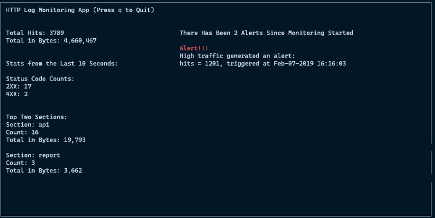
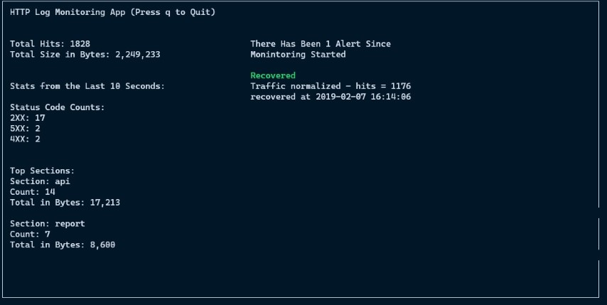

# HTTP Log Monitoring App

This HTTP Log Monitoring App can be used to tail a log file, which will alert if there are any high traffic anomolies while also displaying stats over time.

1. Alerting - the app will monitor HTTP traffic logs to alert within a set time window (default is 120 seconds) if the number of hits / second to the web app has breached a set threshold (default is 10 hits / second). The app will also display a recovered message when the average hits / second has dropped below the threshold
2. Stats - the app will display several stats including total hits, total bytes and the top 2 sections with relevant data for each section. Data is refreshed every 10 seconds but can also be adjusted.

- [HTTP Log Monitoring App](#http-log-monitoring-app)
  - [Design](#design)
    - [General Design](#general-design)
    - [Alerting System](#alerting-system)
  - [Instructions](#instructions)
    - [Requirements](#requirements)
    - [Running the app](#running-the-app)
      - [Options](#options)
      - [Simulating logging](#simulating-logging)
    - [Testing](#testing)
  - [Potential Improvements](#potential-improvements)
  - [Sources Used](#sources-used)
    - [Threading](#threading)
    - [Tailing A file](#tailing-a-file)
    - [Parsing Log Lines](#parsing-log-lines)
  - [Screenshots of the App](#screenshots-of-the-app)
    - [Alert State](#alert-state)
    - [Recovered State](#recovered-state)

## Design

### General Design

The general design follows the producer-consumer pattern. While the producer would be the devices creating the log lines, the consumers are set up here to take the logging information and process it to either provide statistics or generate alerts.

`LogReader` - This not only tails the provided log file and parses the text, but also populates the queues that will be consumed by the two consumers.

`LogAlertConsumer` - Alert consumer that takes a queue being populated by the `LogReader` and populates it's local queue to determine whether an alert should be triggerred or if the system has recovered from the alert. Alerting algorithm / system described below.

`LogStatsConsumer` - Stats consumer that takes a separate queue being populated by the `LogReader` to compute stats for a provided interval time size.

`Display` - Uses `curses` to display information to the user.

`Threads` - threads were used for each class in order for each to individually do the work they need to do.

### Alerting System

The main algorithm (check `has_breached_threshold` method in class `LogAlertConsumer`) used is based on a sliding window technique. Timestamps are moved from the main queue to a local queue that will be filled within the time window set. This local queue is then used to get an approximate average hits / second for the time window by taking the length of this local queue and dividing it by the time window (eg. `len(local_queue) / 120`). Before this is computed, any early timestamps that are now outside of the window are popped off the queue.

Several options were also explored for the alerting system. Since the log line timestamps can be slightly out of order...

1. Min Heap was initially used to sort the data as it comes in but this would require adding and removing elements in the heap.
2. Hash map with `timestamp mod time window size` as key to store counts by seconds

But ultimately, the average hits / second was still be an approximation due to timestamps being out of order and end of time window handling.

## Instructions

### Requirements

App was tested both on MacOS Catalina and Windows 10. I tried to build without any external dependencies but `curses` does need a packaged to be installed on `Windows` in order for proper functionality.

1. Python 3.8.3 was used to build the app.
2. `Windows` only dependency: `windows-curses` must be installed via `pip install windows-curses`.
3. There are no other dependencies required.

### Running the app

The app is designed to tail a file. There is an empty file `log-file.log` in `log_files` that can be used to write to but otherwise any file can be passed in. To start the app, use the following command...

`python http_monitor.py log_files/log-file.log`

`q` Will quit out of the app and kill threads

#### Options

`--threshold` - Set the threshold for hits / second. Default is 10 seconds.

`--time_window` - Adjust the time window for alert checks. Default is 120 seconds.

`--interval` - The window for refreshing stats data like top sections. Default is 10 seconds.

#### Simulating logging

In order for local development, a program was created to simulate logging to a file. This should be started separately. First file should be the data file and the second file is the log file that will be written too and monitored by the main app.

`python simulate.py log_files/sample_csv.txt log_files/log-file.log`

Use `Ctrl-C` to exit

### Testing

I made most methods private since the only two methods used within the classes are usually `run` or the method that returns data. In order to test and avoid having to add a package for mocking time and dealing with threads, the private method `should_alert_or_recover` was exposed for testing.

To run the three tests (alert, recover, recover then alert), in root folder...

`python -m unittest`

## Potential Improvements

1. The `curses` implementation is a bit rough as it is my first time using the package and also first time writing an app that displays to a CLI. Better formatting, properly handling window resizing and handling top N with proper spacing would make the display better. For now, top N sections is locked to two sections because of spacing concerns.
2. The simulator that can be used to simulate logging is a simple app that writes to a file line by line with a random sleep time in between each line. There may be better ways to simulate logging but for now the log lines are written to an monitered file slower than it would be in production environment.
3. Test coverage can be added to other parts of the app. Currently only coverage for alerting states.

## Sources Used

There are comments in the app pointing out where sources were used for implementation adaption. The sources used are also listed here.

### Threading

Threading implementation adapted from a gist ["Python thread sample with handling Ctrl-C"](https://gist.github.com/ruedesign/5218221).

Originally, the app was set up to cancel the threads by typing Ctrl-C but this was changed to setting the termination to `False` within `Display`. How the threads are set up per class is also based on this source.

### Tailing A file

Tailing file implementation is from a [presentation](https://github.com/dabeaz/generators/) on tools that leverage the use of Python generators.

### Parsing Log Lines

Regex to parse line for the data required was adapted from an online version of the book [Regular Expressions Cookbook](https://www.oreilly.com/library/view/regular-expressions-cookbook/9781449327453/ch07s12.html), which had a regex for common log formats.

## Screenshots of the App

### Alert State

### Recovered State

