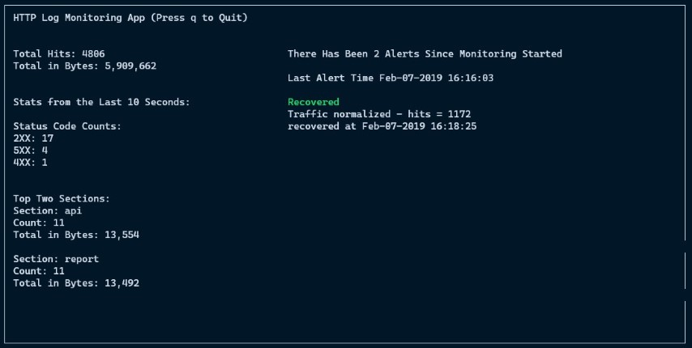

# HTTP Log Monitoring App

This HTTP Log Monitoring App can be used to tail a log file, which will alert if there are any high traffic anomolies while also displaying stats over time.

1. Alerting - the app will monitor HTTP traffic logs to alert within a set time window (default is 120 seconds) if the number of hits / second to the web app has breached a set threshold (default is 10 hits / second). The app will also display a recovered message when the average hits / second has dropped below the threshold
2. Stats - the app will display several stats including total hits, total bytes and the top 2 sections with relevant data for each section. Data is refreshed every 10 seconds but can also be adjusted.

- [HTTP Log Monitoring App](#http-log-monitoring-app)
  - [Design](#design)
    - [General Design](#general-design)
    - [Classes](#classes)
    - [Alerting System](#alerting-system)
  - [Instructions](#instructions)
    - [Requirements](#requirements)
    - [Running the app](#running-the-app)
      - [Options](#options)
      - [Simulating logging](#simulating-logging)
    - [Testing](#testing)
  - [Potential Improvements](#potential-improvements)
    - [Scaling](#scaling)
    - [Alert State](#alert-state)
    - [Recovered State](#recovered-state)

## Design

### General Design

The general design follows the producer-consumer pattern. While the producer would be the devices creating the log lines, the consumers are set up here to take the logging information and process it in order to provide both statistics and generate alerts.

There is 1 thread for each class (described below) to avoid blocking each other while producing and displaying what is needed.

The app does work in `real time` while tailing a log file. Tailing can be simulated using a very basic implementation in `simulate.py` but otherwise the assumption was that 10 seconds / 2 minutes should be real time passed. For stats, the timestamps in the file doesn't matter but instead just real time. For alerting, real time is used for the 2 minute window but the alerting logic uses timestamps from the log lines.

### Classes

`LogReader` - This not only tails the provided log file and parses the text, but also populates the queues that will be consumed by the two consumers. This means that the log data is never stored in memory entirely but instead quickly passed on to be consumed and processed by the consumers.

`LogAlertConsumer` - Alert consumer that takes a queue being populated by the `LogReader` and populates it's local queue to determine whether an alert should be triggerred or if the system has recovered from the alert. Alerting algorithm / system described below.

`LogStatsConsumer` - Stats consumer that takes a separate queue being populated by the `LogReader` to compute stats for a provided interval time size. As mentioned above, real time is used to refresh the data every 10 seconds.

`Display` - Uses `curses` to display data to the user by getting updated data from the two consumers.

### Alerting System

The main algorithm (`has_breached_threshold` method in class `LogAlertConsumer`) is based on a sliding window technique. Timestamps are moved from the main queue to a local queue that will be filled within the set time window. This local queue is then used to get an `approximate average hits / second` for the time window by taking the length of this local queue and dividing it by the time window (eg. `len(local_queue) / 120`).

So that the alerting is based on the timestamps within the file as opposed to current time, the log timestamps are used to ensure that any early timestamps that fall out of the log time window are popped off the queue before computing the approximate average. This means that the local queue is only ever holding the number of timestamp ints that correspond to hits that the consumer moved into the queue within the set time window.

Several options were also explored for the alerting system. Since the log line timestamps can be slightly out of order...

1. Min Heap was initially used to sort the data as it comes in but this would require repeatedly adding and removing elements in the heap that is mostly sorted but many duplicates.
2. Hash map with `timestamp mod time window size` as key to store counts by seconds

But ultimately, the average hits / second was still an approximation due to timestamps being out of order and that it would only really address the start of the window and not the end.

## Instructions

### Requirements

App was tested both on MacOS Catalina and Windows 10.

1. Python 3.8.3 was used to build the app.
2. `Windows` only dependency: `windows-curses` must be installed via `pip install windows-curses`.
3. There are no other dependencies required.

### Running the app

The app is designed to tail a file. There is an empty file `log-file.log` in `log_files` that can be used to write to but otherwise any log file that will logged to can be passed in. To start the app, use the following command...

`python http_monitor.py log_files/log-file.log`

`NOTE`: Since the app is designed around `tailing a file`, passing in the provided `sample_csv.txt` file `will not work`. If a log file to tail isn't available, this can be simulated as described below.

Use `q` to quit out of the app and cleanly terminate the threads.

#### Options

`--threshold` - Set the threshold for hits / second. Default is 10 seconds.

`--time_window` - Adjust the time window for alert checks. Default is 120 seconds.

`--interval` - The window for refreshing stats data like top sections. Default is 10 seconds.

#### Simulating logging

In order for local development, a program was created to simulate logging to a file. This should be started separately. First file should be a data file like the one provided and the second file should be the log file that will be written too and monitored by the main app.

`python simulate.py log_files/sample_csv.txt log_files/log-file.log`

Use `Ctrl-C` to exit.

### Testing

To run the unit tests (alert, recover, recover then alert), in root folder...

`python -m unittest`

## Potential Improvements

### Scaling

Generally, the app is efficient as it never reads data entirely into memory but only chunks of data is saved temporarily based on set interval and window size times.

For scaling,

1. Ideally log monitoring and processing is not done on the same server and especially not on the app server.

2. The producer-consumer pattern used in the app lends itself well to a Kafka like setup where data from producers are moved to queues on Kafka. The consumers can then take from these queues as required. This also allows for scaling of the intake queues as traffic requires.

3. The consumers can also be moved to their own servers dependent on computing need since they are independent of each other and use their own queues of data.

### Alert State

### Recovered State

